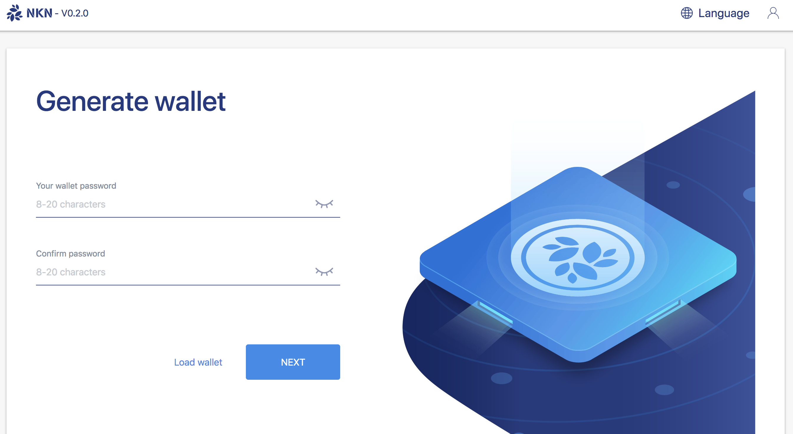
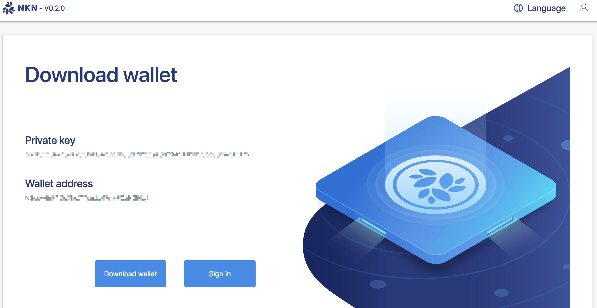
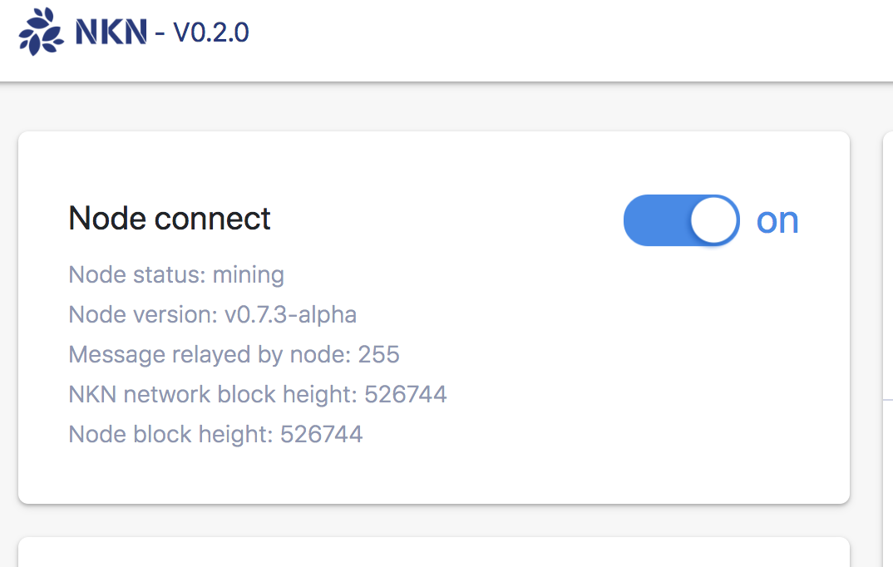
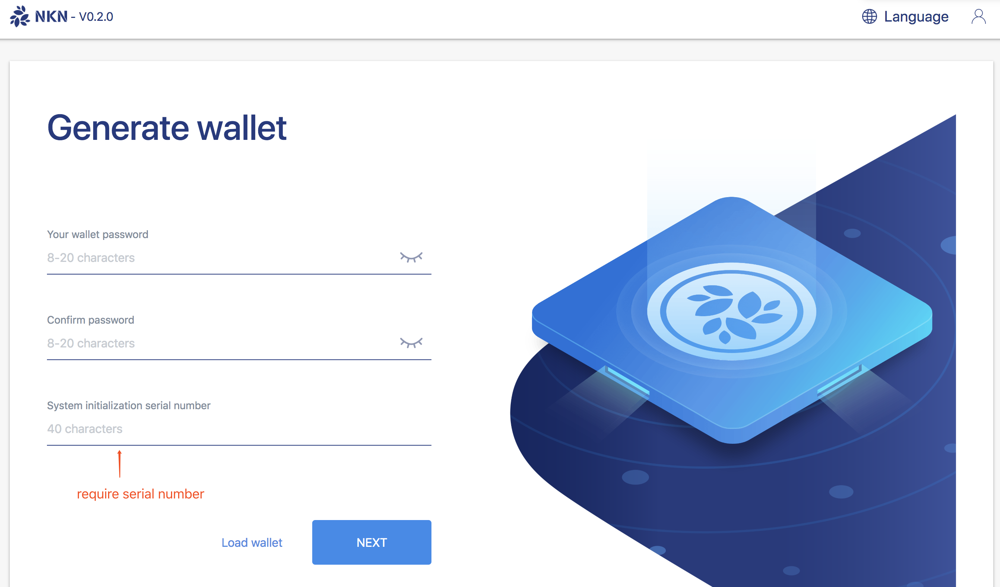

# nkn-mining

NKN mining web application. 

+ [How to use](#How-to-use)
    - [For home users](#For-home-users)
    - [For cloud users](#For-cloud-users)
+ [Migrate from version under 0.2.0](#migrate-from-version-under-020)


## How to use 

### What do you need first!

1. A computer to run the NKNMining application
2. A public ipv4 address
3. Permission of port open between 30001 ~ 30003 and port 8181


### For home users 
1. Download the zip file from the lastest [release](https://github.com/nknorg/nkn-mining/releases).
2. Unzip the file to any directory you want.
3. Open a command line window, and cd to the directory where the  NKNMining file is. e.g:
4. Run the NKNMining program. e.g:
5. Open http://127.0.0.1:8181/web/  to start NKN mining travel. e.g:
    - Create a new wallet or load an exits one.
    
    - Sing in
    
    - Start mining
    

### For cloud users 
1. Download the zip file to your server from the lastest [release](https://github.com/nknorg/nkn-mining/releases).
2. Unzip the file to any directory you want.
3. Run the NKNMining program with parameter --remote. NKNMining will output a 40 character length ‘serial number’. e.g:
```text
$ ./NKNMining --remote
$ serial number(sn): NKN-fef5d6b5-ba56-11e8-9c0b-260049909001
```

4. Open http://ip:8181/web/ to start NKN mining travel. e.g:
    - Create a new wallet or load an exits one (this step request serial number).
    
    - Sing in
    
    - Start mining
    


## Migrate from version under 0.2.0
1. Download your wallet file from the webpage. e.g:
2. Restart your computer or your server.
3. Setup version V0.2.0 NKNMining with the wallet you downloaded.

## Q&A 

Discord: [https://discord.gg/wUBNKFm](https://discord.gg/wUBNKFm)

 **Note: This repository is in the early development stage and may not have all functions working properly. It should be used only for testing now.**
