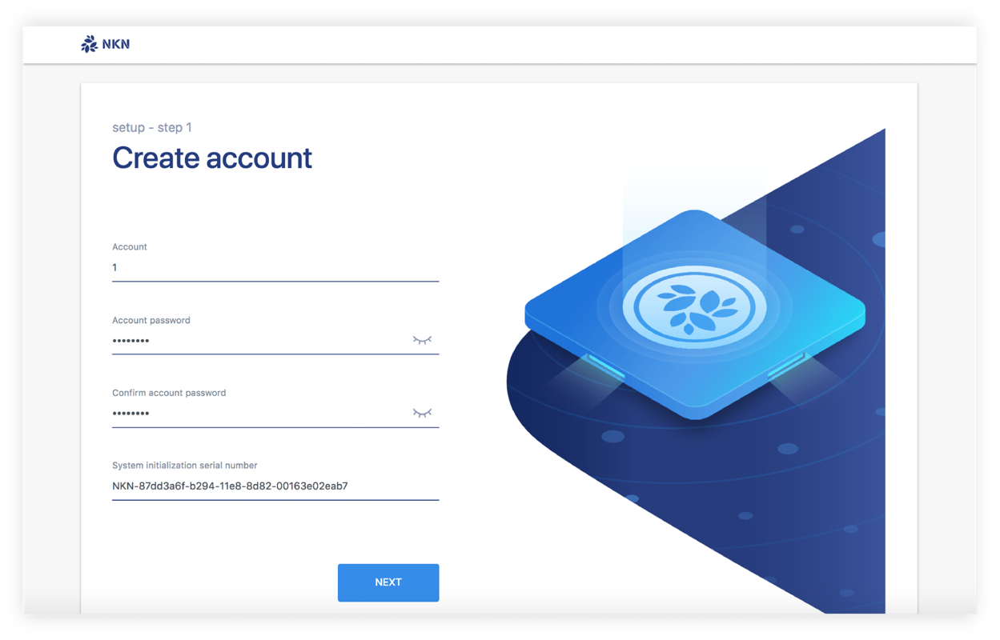
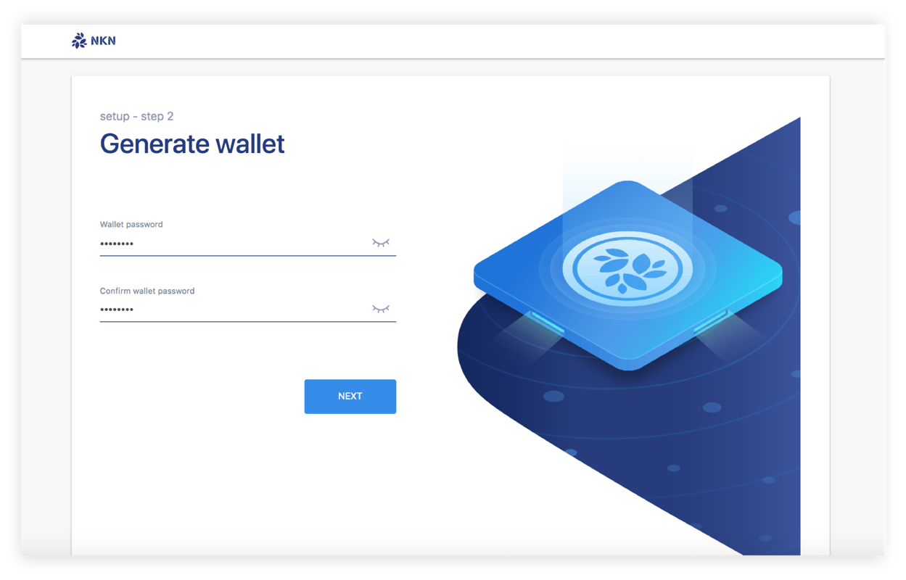
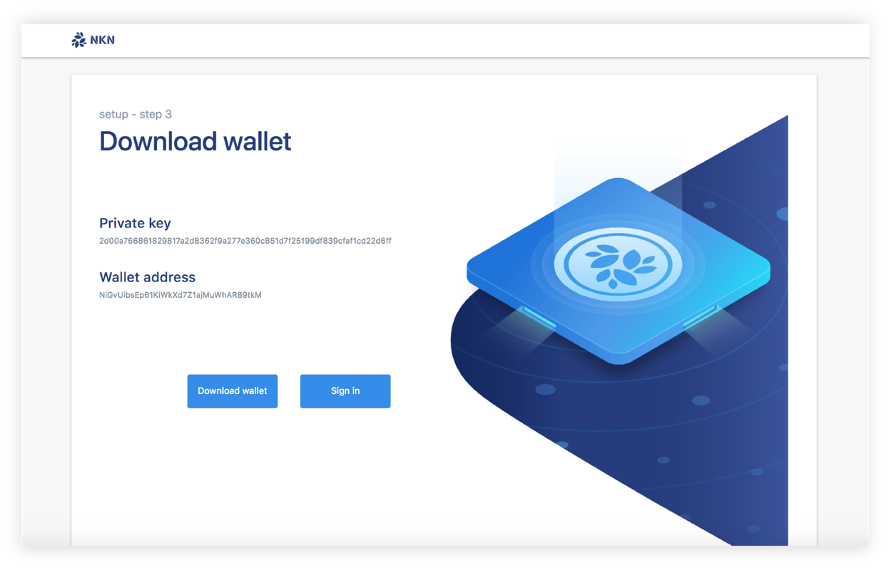
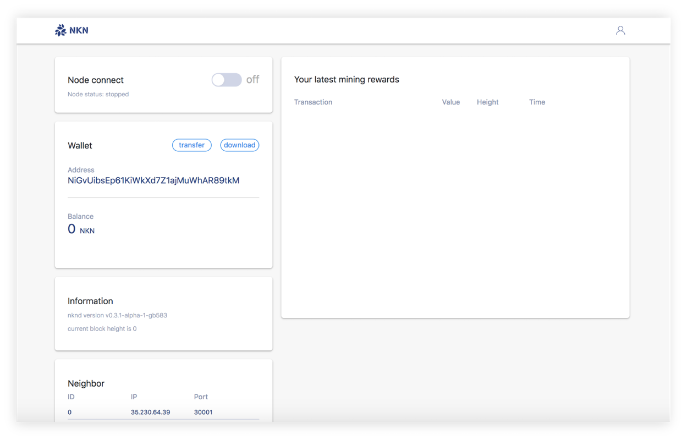

# How to use

## What do you need first!

1. A computer to run the NKNMining application
2. A public ipv4 address
3. Permission of port open between 30000 ~ 30003

### step 0

Upload the package to your server and run NKNMining program.

NKNMining will output a 40 character length ‘serial number’ .

```text
$ ./NKNMining
$ serial number(sn): NKN-fef5d6b5-ba56-11e8-9c0b-260049909001
```

### step 1

Open http://ip:8181/web/  to create your control account.e.g:

```text
http://127.0.0.1:8181/web/
```



**Note: ‘System initialization serial number’ here is the ‘serial number’ string from step 0.**

### step 2

Generate a wallet for node running.



**Note: password in this page is for wallet.**

### step 3

In this step you will see your wallet information.Also you can click ‘Download wallet’ button to save your wallet file.



### step 4

The NKN node is setup already! Now you can turn on/off your node to mining NKN or transfer some NKN you mined to someone else.



### Q&A

Discord: [https://discord.gg/wUBNKFm](https://discord.gg/wUBNKFm)

