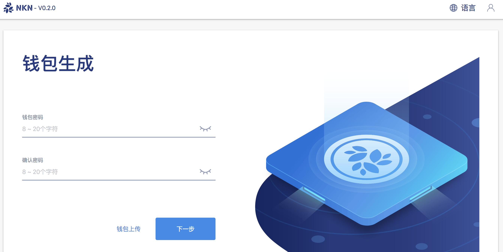
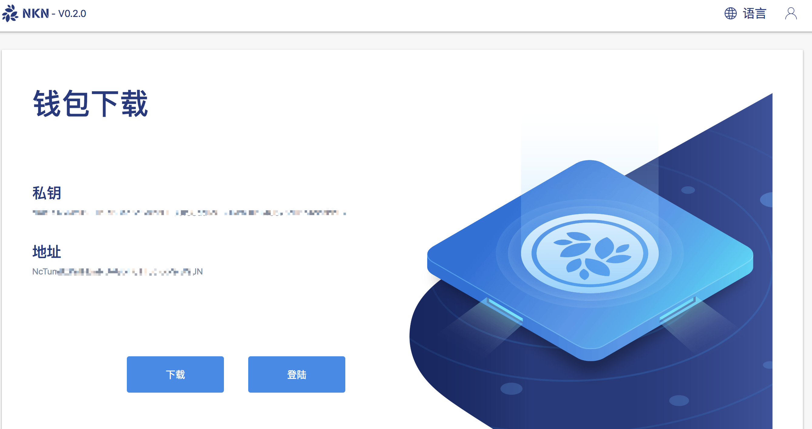
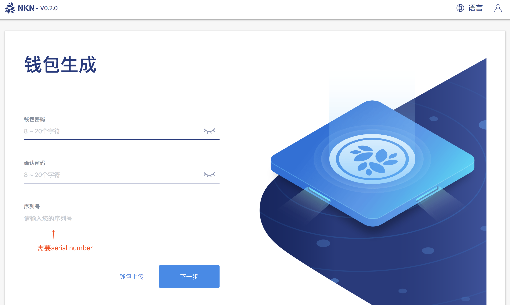

# nkn-mining

NKN web版挖矿软件 

+ [如何使用](#如何使用)
    - [家庭用户](#家庭用户)
    - [云服务器用户](#云服务器用户)
+ [从0.2.0之前的低版本迁移](#从020之前的低版本迁移)


## 如何使用 

### 运行环境

1. 一台可以运行NKNMining的机器。NKNMining支持Windows、MAC OSX、Linux三种操作系统。
2. 一个公网IP地址
3. 开发机器的30001 ~ 30003端口以及8181端口


### 家庭用户
1. 从[release](https://github.com/nknorg/nkn-mining/releases)页面下载最新的NKNMining程序压缩包。
2. 解压NKNMining压缩包到任何您认为合适的文件夹下。
3. 打开命令行窗口，并使用cd命令进入到NKNMining所在文件夹下。 
4. 执行NKNMining程序。
5. 在浏览器中打开这个网址 http://127.0.0.1:8181/web/ 就可以进行配置和挖矿了。 
    - 创建或导入一个钱包： 
    
    - 点击登录以进入主界面
    
    - 开始挖矿
    

### 云服务器用户 
1. 从[release](https://github.com/nknorg/nkn-mining/releases)下载最新的NKNMining程序压缩包到您的服务器。
2. 解压NKNMining压缩包到任何您认为合适的文件夹下。
3. 使用--remote参数执行NKNMining程序，NKNMining 程序会输出一个40个字符长度的‘serial number’。 样例如下： 
```text
$ ./NKNMining --remote
$ serial number(sn): NKN-fef5d6b5-ba56-11e8-9c0b-260049909001
```

4. 在浏览器中打开这个网址 http://ip:8181/web/ 就可以进行配置和挖矿了。 样例如下：
    - 创建或导入一个钱包（这一步需要用到serial number）： 
    
    - 点击登录以进入主界面
    
    - 开始挖矿
    


## 从0.2.0之前的低版本迁移 
1. 从低版本的web页面上下载您的钱包到本地。
2. 重启您的电脑或者云服务器。
3. 在启动NKNMining V0.2.0的过程中使用您刚才下载的钱包。

## Q&A 

Discord: [https://discord.gg/wUBNKFm](https://discord.gg/wUBNKFm)

 **注意：本程序处于早期开发阶段，可能无法正常运行所有功能。 它现在应该仅用于测试。**
